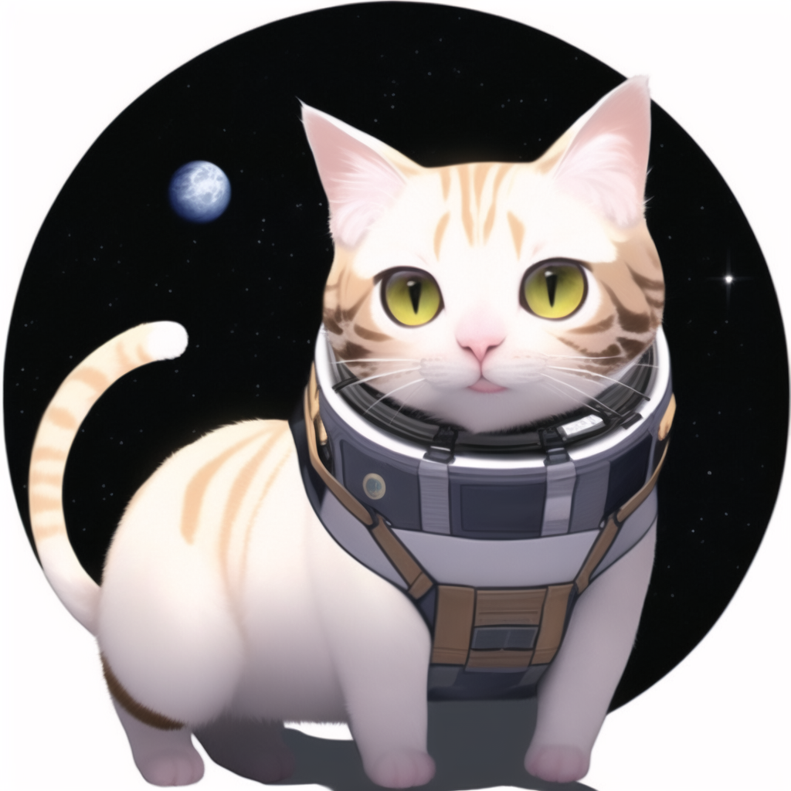

# novelai-png-metadata-cli

Example output:

```
$ novelai-png-metadata-cli metadata --file .docs/sample-cat.png | jq . 
{
  "title": "AI generated image",
  "software": "NovelAI",
  "source": "Stable Diffusion 1D44365E",
  "prompts": "masterpiece, best quality,  cat, space, icon",
  "uc": "lowres, bad anatomy, bad hands, text, error, missing fingers, extra digit, fewer digits, cropped, worst quality, low quality, normal quality, jpeg artifacts, signature, watermark, username, blurry, lowres, bad anatomy, bad hands, text, error, missing fingers, extra digit, fewer digits, cropped, worst quality, low quality, normal quality, jpeg artifacts, signature, watermark, username, blurry",
  "steps": 50,
  "strength": 0.4,
  "seed": 2253955223,
  "scale": 10,
  "sampler": "k_euler_ancestral",
  "noise": 0
}
```


